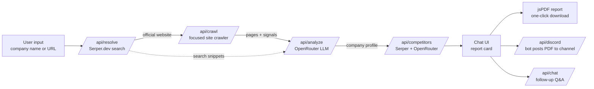

# Company Research AI 🔍

     

**AI-powered Company Research Assistant** — enter a company name or website URL and get a full research report: company info (incl. founders & founding year), products & services, AI-generated pain points, competitor analysis, and a professional downloadable PDF — in a ChatGPT-style interface.

> ### 🔗 Live demo: **https://fte-hackathon.vercel.app**
> Built for the Relu Consultancy — AI & Automation Developer hiring challenge (Aug 2026).

## What it does

Type **`Stripe`** or **`https://stripe.com`** and watch four live steps run:

```
① Finding official website     Serper.dev knowledge graph → stripe.com
② Crawling website pages       7 pages analyzed (adaptive: up to 12 if data is missing)
③ AI analysis (OpenRouter)     your chosen model → structured JSON profile
④ Identifying competitors      5 found, with real websites
```

You get a report card with the company's phone, address, founders, founding year, industry,
products & services, AI-generated pain points and competitors — then **one click** for a
professional PDF, which also auto-posts to Discord if configured. You can keep chatting to
ask follow-up questions about the researched company.

## How it works



The pipeline runs as **four small API steps orchestrated by the client** (resolve → crawl → analyze → competitors). Each step paints live progress in the chat, is independently retryable, and stays comfortably inside serverless execution limits — no single long-running request.

1. **Resolve** — URL input is used directly; a company name becomes a Serper.dev search where the knowledge-graph website (or first non-aggregator organic hit) is taken as the official site.
2. **Crawl** — fetches the homepage, scores internal links by path keywords (`about`, `contact`, `products`, `services`, `solutions`, `pricing`, …), skips login/legal/blog/asset URLs, respects `robots.txt`, dedupes by normalized URL **and** content fingerprint, then fetches the top pages concurrently. **Adaptive depth:** if the first wave (7 pages) finds no contact signals or thin content, a second wave digs up to 12 pages, discovering links from crawled pages, not just the homepage. Extracts readable text plus deterministic signals: `tel:`/`mailto:` links, schema.org JSON-LD phone/address, social profiles.
3. **Analyze** — crawled content + a Serper enrichment search go to an OpenRouter model which returns a **schema-validated JSON profile** (summary, products/services, pain points, industry, HQ). Crawler-found contact details override LLM output — generative models are never the source of truth for phone numbers.
4. **Competitors** — a Serper "competitors" search grounds the LLM, which returns validated competitors (same country/industry preferred); results are deduped and the target company is filtered out.

## Features → evaluation criteria

| Criterion | What's implemented |
|---|---|
| **Company Research** | Both input modes (name / URL); official-website detection; name, website, phone, address, **founders, founding year**, industry, products/services, AI pain points |
| **Website Crawling** | Priority-scored page discovery, **adaptive two-wave depth (7→12 pages when info is missing)**, duplicate detection (URL + content fingerprint), login/irrelevant-page filtering, robots.txt respect, concurrent fetches with per-page timeouts, JSON-LD & `tel:` extraction |
| **OpenRouter AI** | Any OpenRouter model via a custom picker (live model list, **free-tier/all toggle + search**); the active model is always shown above the composer; retry-then-fallback chain when a free model is rate-limited, with the substitution labelled in the UI **and** the PDF; strict-JSON prompts with zod validation + one corrective retry |
| **Serper.dev** | Official-site resolution, contact-info enrichment, competitor discovery — three distinct research uses |
| **Competitor Analysis** | 4–6 real competitors with name, website and a one-line "why it competes" |
| **PDF Report** | One-click professional A4 report (jsPDF): header band, company info, summary, products, pain points, competitor table with clickable links, sources, page numbers |
| **Chat UI** | ChatGPT-style dark interface, live pipeline progress, follow-up Q&A about the researched company, mobile-responsive (slide-over settings), loading states everywhere |
| **Discord (bonus)** | Settings tab for bot token + channel ID + applicant details; after each report the PDF auto-posts to the channel as an embed + attachment |
| **Deployment & docs** | One-click Vercel deploy; this README; `.env.example` documents every variable |

## Project structure

```
src/
├── app/
│   ├── page.tsx              # chat UI + client-side pipeline orchestration
│   ├── layout.tsx            # metadata, fonts
│   ├── globals.css           # dark theme tokens
│   └── api/
│       ├── resolve/          # ① company name or URL → official website (Serper)
│       ├── crawl/            # ② adaptive website crawler
│       ├── analyze/          # ③ OpenRouter → structured company profile
│       ├── competitors/      # ④ Serper + OpenRouter → competitor list
│       ├── chat/             # follow-up Q&A about the researched company
│       ├── models/           # live OpenRouter model list (cached 30 min)
│       └── discord/          # bonus: post report + PDF to a Discord channel
├── components/
│   ├── Sidebar.tsx           # API keys, model picker, Discord settings
│   ├── ModelPicker.tsx       # custom dropdown: free/all toggle + search
│   ├── ResearchCard.tsx      # live progress + full report card
│   └── ChatInput.tsx         # composer, active-model chip, research/ask modes
└── lib/
    ├── crawler.ts            # link scoring, robots.txt, dedupe, JSON-LD extraction
    ├── serper.ts             # Serper.dev client + HQ lookup
    ├── openrouter.ts         # model fallback chain, JSON validation w/ retry
    ├── prompts.ts            # all LLM prompts in one reviewable place
    ├── pdf.ts                # jsPDF report builder (Unicode-safe)
    ├── client.ts             # browser API client + settings persistence
    ├── http.ts               # timeouts, retries, typed errors
    ├── api.ts                # key resolution + uniform error responses
    └── types.ts              # shared domain types
```

## Quickstart (local)

```bash
git clone https://github.com/Martian172/fte-hackathon.git
cd fte-hackathon
npm install
cp .env.example .env.local   # then paste your keys into .env.local
npm run dev                  # http://localhost:3000
```

Requires Node.js 18.18+ (Node 22 recommended).

**Keys** (both free):

| Variable | Get it at | Purpose |
|---|---|---|
| `OPENROUTER_API_KEY` | [openrouter.ai](https://openrouter.ai) → Keys | AI analysis (free-tier models work without credits) |
| `SERPER_API_KEY` | [serper.dev](https://serper.dev) | Google search (2,500 free queries) |
| `DISCORD_BOT_TOKEN` *(optional)* | Discord Developer Portal | Fallback for the Discord bonus feature |

Server env keys are **optional**: users can paste their own keys in the sidebar (stored in `localStorage`, sent per-request as headers to this app's own API routes only, never logged, never committed).

## Deploy (Vercel)

1. Push to GitHub → [vercel.com](https://vercel.com) → **Add New → Project** → import the repo (defaults are fine).
2. Add `OPENROUTER_API_KEY` and `SERPER_API_KEY` under **Settings → Environment Variables**.
3. Deploy — done.

## Discord integration (bonus)

Sidebar → **Discord** tab → paste the bot token + channel ID (evaluator-provided) and applicant name/email → Save. Every completed research then auto-sends applicant details, company name/website and the PDF report to the channel. The bot needs **Send Messages** + **Attach Files** permissions in that channel.

## Edge cases handled

- **Site blocks the crawler / is offline** → research continues on Serper data alone (crawl returns a warning, not an error)
- **`www.` vs apex mismatch** → crawler retries the alternate host automatically
- **Company name with no clear official site** → friendly message suggesting direct URL input
- **LLM returns invalid/malformed JSON** → code-fence stripping + bracket slicing + zod validation + one corrective retry, then a clean error — the UI never renders garbage
- **Selected model rate-limited/unavailable (free tiers!)** → automatic fallback chain ending in OpenRouter's free-models router
- **Missing API keys** → clear on-screen message pointing at the sidebar, not a stack trace
- **Phone/address hallucination** → deterministic crawler signals (JSON-LD, `tel:` links) override LLM values; fields render "Not publicly listed" instead of invented data
- **Duplicate pages** (`/` vs `/home`, tracking params) → URL normalization + content fingerprint dedupe
- **Aggregator domains** (LinkedIn/Wikipedia/Crunchbase…) never mistaken for the official site
- **Huge pages / binary URLs** → content-type check, 1.5 MB HTML cap, 5 KB per-page text cap, 16 KB total LLM digest budget (top-priority pages in full, tail pages trimmed)
- **No address published on the site** → dedicated Serper HQ lookup (knowledge-graph attribute, then a "headquartered in …" snippet pattern) before giving up
- **Timeouts & transient failures** → every external call has a timeout (4–45 s by type) and exponential-backoff retry on 429/5xx
- **Discord failures** (bad token, missing permissions, wrong channel, >8 MB PDF) → specific human-readable messages + manual retry button; a Discord failure never fails the research
- **Long inputs / prompt injection surface** → input length caps, crawled text truncation, keys only in headers server-side

## Tech stack

- **Next.js 16** (App Router, TypeScript) — one unified project for UI + API
- **Tailwind CSS v4** — dark ChatGPT-style interface
- **cheerio** — HTML parsing/extraction · **zod** — runtime validation of every request body and LLM output · **jsPDF** — client-side PDF
- **Serper.dev** (search, mandated) · **OpenRouter** (AI, mandated; default `nvidia/nemotron-3-super-120b-a12b:free`)

### Prompt design notes

Prompts live in [`src/lib/prompts.ts`](src/lib/prompts.ts). Both AI tasks demand a single JSON object, define the exact shape inline, forbid invented contact details (`null` when unknown), and give the pain-points prompt an explicit "consultant briefing an account executive" voice with an anti-generic-filler rule — that is what turns output from "keeping up with technology" into "dependence on banking partners for settlement rails".

## Hackathon deliverables checklist

- ✅ **Source Code** — this repository (TypeScript end-to-end, typed & documented)
- ✅ **Deployment URL** — https://fte-hackathon.vercel.app
- ✅ **README.md** — this file
- ✅ **Setup Instructions** — [Quickstart](#quickstart-local) above
- ✅ **Environment Variable Documentation** — [.env.example](.env.example) + table above
- ✅ **Website Crawling Implementation** — [`src/lib/crawler.ts`](src/lib/crawler.ts) (adaptive two-wave crawler)
- ✅ **AI Company Research** — [`src/app/api/analyze/route.ts`](src/app/api/analyze/route.ts) + [`src/lib/prompts.ts`](src/lib/prompts.ts)
- ✅ **Competitor Analysis** — [`src/app/api/competitors/route.ts`](src/app/api/competitors/route.ts)
- ✅ **PDF Generation** — [`src/lib/pdf.ts`](src/lib/pdf.ts) (jsPDF, Unicode-safe)
- ✅ **Discord Integration (Bonus)** — [`src/app/api/discord/route.ts`](src/app/api/discord/route.ts) + sidebar settings tab

## Known limitations & next steps

- Crawler stays on the main host (+`www.`) — subdomain docs/blogs are deliberately out of scope
- Free-tier models have daily caps; heavy judging traffic may engage the fallback router
- No persistence by design (assignment: no database required) — reports live in the chat session
- Next: streaming token-level progress, multi-language crawling, LinkedIn enrichment, export to DOCX
